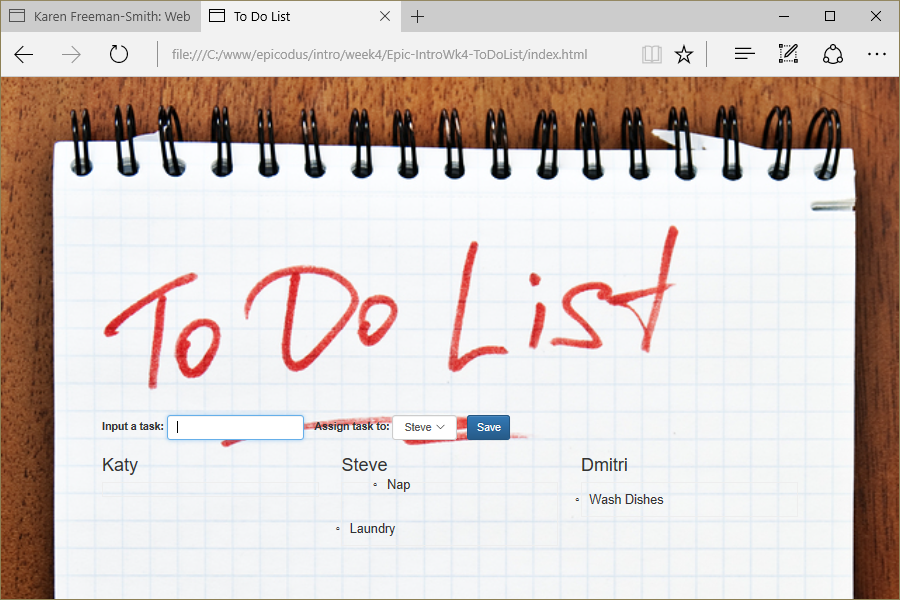

# To Do List
Version 0.0.2: January 31, 2017
by [Karen Freeman-Smith](https://karenfreemansmith.github.io) 

### Technologies Used
HTML, CSS, Bootstrap, JavaScript, jQuery, jQueryUI(drag & drop)

## Description
*[Epicodus](http://epicodus.com) Intro to Programming Week 4 Pair Project with [Ewa Manek](htps://github.com/ewajm): A web-based to-do list with drag and drop tasks updated to use local storage and sort tasks by type rather than people.*

## Setup/Installation
* [View on Github Pages](https://karenfreemansmith.github.io/Epic-IntroWk4-ToDoList)
* _OR_
* Clone directory
* Open index.html in your favorite browser

## Support & Contact
For questions, concerns, or suggestions please email karenfreemansmith@gmail.com

## Specifications

* User can add a new task and assign it to a category
* User can double-click a task to complete
* User can move a task to new category (drag and drop)
* Tasks are saved to local storage and load when page reloads
* Tasks can be reordered within a category (drag and drop)

## Known Issues
* Only tasks added since last reload "hear" double-click, so can't complete older tasks

## Future Enhancements
* Save order of tasks within categories
* Edit (Add/Delete) categories
* Edit tasks
* Delete tasks

## Legal
*Licensed under the GNU General Public License v3.0*

Copyright (c) 2016 Copyright _[Karen Freeman-Smith](https://karenfreemansmith.github.io)_ All Rights Reserved.
